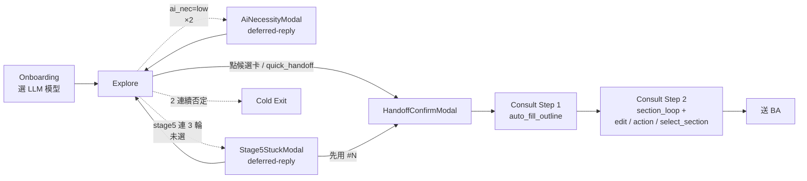
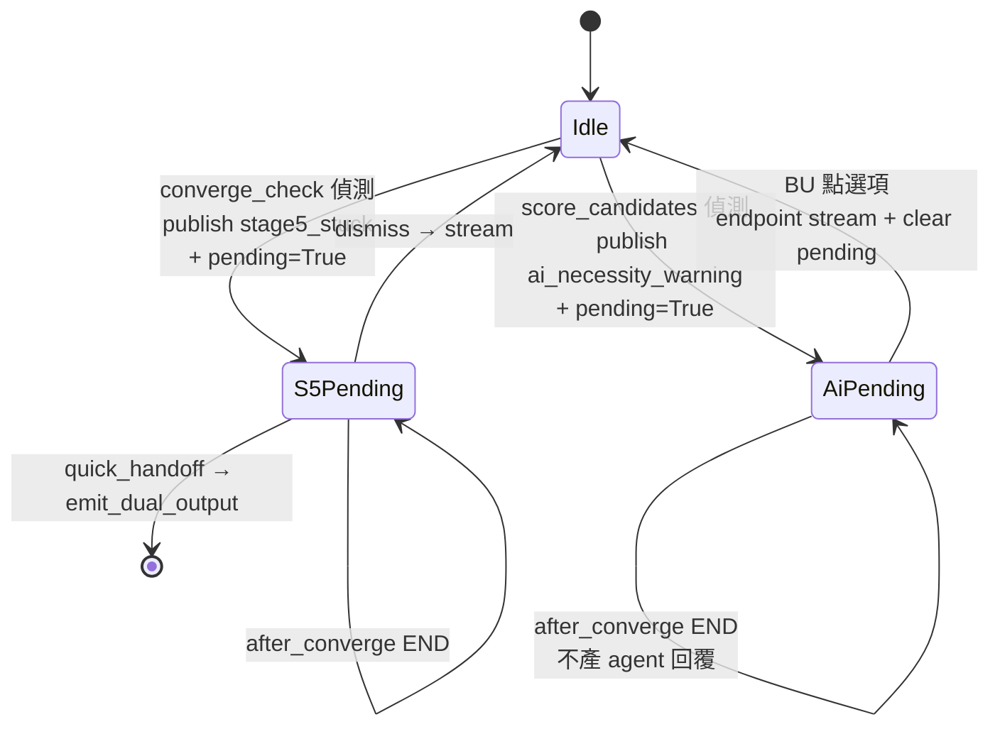
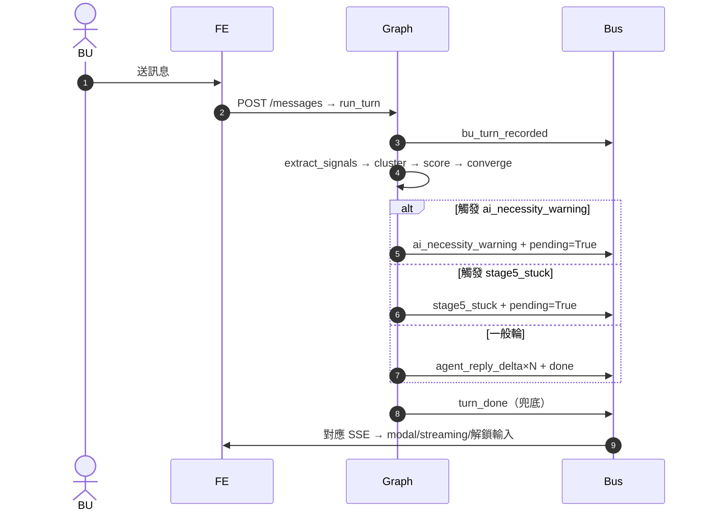
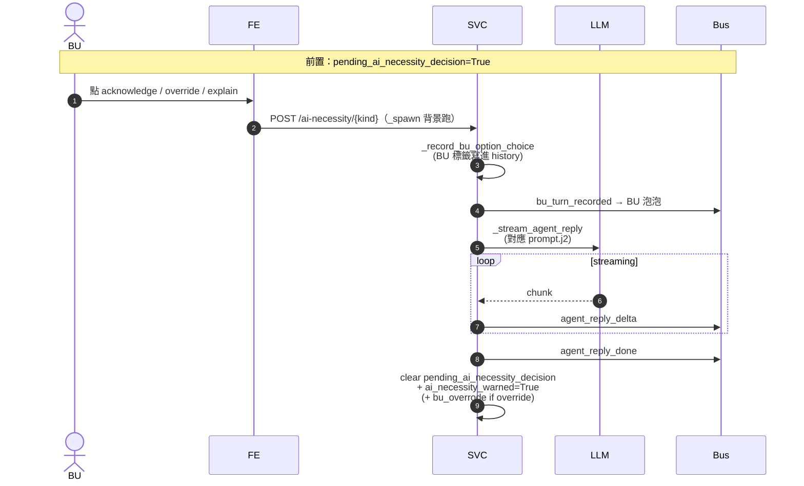

# BU Agent 系統流程圖（Miro-ready）

> **Last updated 2026-05-25** — 對齊 code 現況的 18 張 Mermaid 流程圖
> 用途：跨 backend / frontend / SSE / LLM / DB 邊界的視覺化單一入口；給新人 onboard、給 PM review、給工程師 debug
> 配套檔：`Plan_BU_Agent/diagrams/*.mmd`（每張一檔，Miro 可獨立 import）

---

## TL;DR（30 秒 onboard）

BU Agent 是「BU 端 BRD 草擬助手」：
1. **Onboarding**：BU 在 `/sessions/new` 填 BU 別 / 角色 / hint，**選一個 LLM 模型**（OpenAI / Gemini，session 級綁定）
2. **Explore mode**：5 階段對話迴圈，agent 從 BU 痛點抽 candidates（含 5 維 score + AI 必要性 triage），途中可能彈 **AI 必要性彈窗**或 **Stage 5 收斂彈窗**（兩個都採 deferred-reply pattern：graph 暫停、BU 點選項才 LLM stream 回應）
3. **Handoff**：BU 點候選卡或快速 handoff → emit_dual_output 產 paragraph + structured JSON → BU 在 HandoffConfirmModal 確認
4. **Consult mode**：Step 1 自動填 BRD 大綱、Step 2 對 needs_round2 章節 LLM 訪談；BU 可 inline edit / Accept / Refine / Skip / Flag / 切章重訪
5. **送 BA**：build_deliverables 寫入 deliverables 表 → 跳完成畫面

---

## Diagram Index

### Part A — 結構圖（活動 / 狀態圖視角）

| ID | 檔名 | 主題 | 一句話 |
|---|---|---|---|
| **L0** | `00_main_journey.mmd` | 端到端旅程 | 從 login 到送 BA 的高層活動圖（含 cold / 三個 modal 的岔出路徑） |
| L1.1 | `10_explore_subgraph.mmd` | Explore Subgraph | 7 個節點 + 7 分支 after_converge routing；ai_necessity / stage5_stuck / cold 三條岔出 |
| L1.2 | `11_consult_subgraph.mmd` | Consult Subgraph | load_template → auto_fill_outline → section_loop → quality_gate → build_deliverables；entry router 4 分支 |
| L1.3 | `12_deferred_reply_pattern.mmd` | Deferred-Reply Pattern | `pending_*_decision` flag 的 state machine（Idle / AiPending / S5Pending / ReadyHandoff） |
| L1.4 | `13_sse_event_flow.mmd` | SSE 事件全圖 | 18 個 event：backend publisher → SessionBus → frontend handler |
| L1.5 | `14_llm_routing.mmd` | LLM 多後端路由 | 模型選單 → `_resolve_backend` → 三個 backend；旁掛 `models_catalog` 動態抓 |
| L1.6 | `15_session_mode_states.mmd` | Session Mode 狀態機 | explore / cold / consult_step1 / consult_step2 / submit / done 之間的轉換條件 |

### Part B — Sequence 圖（user action 視角）

| ID | 檔名 | 觸發 user action | 涵蓋 |
|---|---|---|---|
| **S01** | `20_seq_create_session.mmd` | 在 `/sessions/new` 填表 + 選模型 + 送出 | listModels → createSession → 第一輪 graph kickoff |
| **S02** | `21_seq_resume_session.mmd` | F5 重整 / 從 list 點進舊 session | useQuery + SSE 重連 + ring buffer replay + cache-read 防呆 + cleanup useEffect 兜底 |
| **S03** | `22_seq_send_message_explore.mmd` | Explore 送訊息一輪 | run_turn → extract_signals / cluster / score / converge → discovery_loop or acknowledge_and_guide → SSE delta/done → turn_done |
| **S04** | `23_seq_select_candidate.mmd` | 工作區點候選卡 | selectCandidate → ready_to_handoff=True → emit_dual_output → handoff_ready |
| **S05** | `24_seq_modal_ai_necessity.mmd` | AiNecessityWarningModal 三選一 | 共用 `_run_ai_necessity_decision`；BU label 寫 history → LLM stream → clear pending |
| **S06** | `25_seq_modal_stage5_stuck.mmd` | Stage5StuckModal 三選一 | dismiss → LLM stream 換切角；quick_handoff → 不 stream 直接 emit_dual_output |
| **S07** | `26_seq_modal_handoff.mmd` | HandoffConfirmModal 兩選一 | confirm: load_template + auto_fill_outline；dismiss: 清 ready_to_handoff |
| **S08** | `27_seq_section_edit_action.mmd` | Consult Step 2 inline edit + Accept/Refine/Skip/Flag | editSection / sectionAction → graph aupdate_state → section_updated |
| **S09** | `28_seq_select_section.mmd` | 點 strip 切章 + RevisitSection 防呆 | selectSection → reset 該章為 needs_round2 → ainvoke → section_loop 重訪 |
| **S10** | `29_seq_submit_ba.mmd` | 點「送 BA」 | submitSession → build_deliverables → 寫 deliverables → router push /done |
| **S11** | `30_seq_reset_and_cold.mmd` | 重新探索 + cold_exit（合併） | Path A: reset_explore；Path B: graph 偵測 2 連續否定 → mode=cold |

---

## 主要 5 張內嵌（30 秒看懂全貌）

### L0 端到端旅程（縮略）


完整版：`diagrams/00_main_journey.mmd`

### L1.3 Deferred-Reply 核心 pattern


完整版：`diagrams/12_deferred_reply_pattern.mmd`

### S03 Explore 送訊息一輪（縮略）


完整版：`diagrams/22_seq_send_message_explore.mmd`

### S05 AI 必要性 modal 三選一（縮略）


完整版：`diagrams/24_seq_modal_ai_necessity.mmd`

### L1.5 LLM 多後端路由（縮略）

```mermaid
flowchart LR
    NewSess[New Session 頁<br/>模型選單] -->|GET /api/v1/models| Catalog[models_catalog<br/>動態抓 + 過濾<br/>+ 5min cache]
    Catalog --> OAI[OpenAI API]
    Catalog --> GEM[Gemini API]
    NewSess -->|llm_model| Create[create_session<br/>寫 sessions.llm_model]
    Create --> GetLLM[get_llm(model)]
    GetLLM --> Resolve{_resolve_backend<br/>model id 前綴}
    Resolve -- gpt-/o1/o3/o4 --> OABe[_OpenAIBackend]
    Resolve -- gemini- --> GEBe[_GeminiBackend]
    Resolve -- 缺 key / 其他 --> MK[_MockBackend]
```
完整版：`diagrams/14_llm_routing.mmd`

---

## 如何匯入 Miro

`Plan_BU_Agent/diagrams/` 下已產好兩種格式（同名）：

- **`*.png`** — 2400px 寬白底 raster；拖進 Miro 直接顯示，無格式問題（推薦先用這個試水溫）
- **`*.svg`** — 已後處理過、把 mermaid 預設的 `<foreignObject>` 全部轉成原生 SVG `<text>`。Miro / Inkscape / Affinity 等不支援 foreignObject 的環境都能正確顯示文字，且向量放大不模糊

**最快流程**：直接把 `Plan_BU_Agent/diagrams/*.svg`（或 `.png`）拖進 Miro 畫布即可。建議按 **L0 居中、L1.x 圍繞 L0、Sx 拉成下層 swim lane**；或一個 Miro frame 放一張圖。

**為何要後處理 SVG**：mermaid-cli 預設會把所有 label 包在 `<foreignObject>` 內用 `<div><p>...</p></div>` 渲染（依賴瀏覽器排版）。Miro / 多數向量編輯器無法 render foreignObject，貼上去會看到「框框有了但文字不見」。我們的後處理腳本把 foreignObject 拆成原生 `<text>` + `<tspan>`，跨環境穩定。

### 重新從 .mmd 產 SVG / PNG（mermaid-cli）

```bash
# 一次性安裝 mermaid-cli
npm install -g @mermaid-js/mermaid-cli

# 從 BU_Agent/ 根目錄執行：
# Step 1：批次 render 為 SVG（mermaid 預設輸出，含 foreignObject）
for f in Plan_BU_Agent/diagrams/*.mmd; do
  mmdc -i "$f" -o "${f%.mmd}.svg"
done

# Step 2：後處理把 foreignObject → 原生 <text>
PYTHONIOENCODING=utf-8 python Plan_BU_Agent/diagrams/_svg_foreignobj_to_text.py

# 同時想要 PNG（可選；2400px 寬白底，Miro 直接拖即可）：
for f in Plan_BU_Agent/diagrams/*.mmd; do
  mmdc -i "$f" -o "${f%.mmd}.png" -w 2400 -b white
done
```

> ⚠️ Step 1 + Step 2 必須**先後**跑：先讓 mmdc 算好 layout（必須帶 foreignObject 才能算字寬），再用 Python script 把 foreignObject 拆成 `<text>`。直接用 `htmlLabels: false` 重 render 雖然可去掉部分 foreignObject，但 edge label 仍會殘留，不可靠。

### 替代方案

- **Miro Mermaid 外掛**：Miro toolbar 搜 「Mermaid Diagrams」plugin → 貼 `.mmd` → Insert。輕量但不能 in-place 編輯。
- **mermaid.live**：https://mermaid.live 貼上 `.mmd` → Actions → Download SVG。但 download 出來的 SVG 仍含 foreignObject，丟進 Miro 還是會看到空白框，要走 Step 2 後處理。

---

## Glossary（關鍵術語對照 file:line）

| 術語 | 定義 | 對應 file:line |
|---|---|---|
| `pending_ai_necessity_decision` | AI 必要性彈窗已發、等 BU 選項；期間 graph END 不產回覆 | `state.py` GraphState、`nodes.py:311` patch、`subgraph.py:53` early-return |
| `pending_stage5_decision` | Stage 5 收斂彈窗版同上 | `state.py`、`nodes.py:431` patch、`subgraph.py:53` early-return |
| `ai_necessity_warned` | 本 session 已警示過、不再彈 | 同上區塊 |
| `bu_overrode_ai_necessity` | BU 看過警示仍堅持 AI（寫進 BRD `ai_necessity_triage.bu_overrode`） | `nodes.py:551` emit_dual_output |
| `stage_5_stuck_acked` | 本 session 已 ack 過 stuck modal | `state.py` |
| `_run_ai_necessity_decision` | 三個 ai modal endpoint 共用主流程（三段式） | `session_service.py:616` |
| `_record_bu_option_choice` | 寫 BU 選項標籤 trace + publish bu_turn_recorded | `session_service.py:548` |
| `_stream_agent_reply` | 封裝 LLM stream + delta/done publish + fallback | `session_service.py:575` |
| `models_catalog.list_chat_models` | 動態抓 OpenAI/Gemini 模型 + 過濾 chat 用 + 5 分鐘 cache | `services/models_catalog.py` |
| `_resolve_backend` | 依 model id 前綴 / LLM_MODE 決定走哪個 backend | `graph/shared/llm.py` |
| `needs_divergent_question` | 判斷 BU 對候選不滿、走 discovery_loop 而非 acknowledge_and_guide | `nodes.py:95` |
| `_integrate_bu_answer_to_section` | Consult Step 2 把 BU 答案 LLM-merge 進章 draft | `session_service.py:203` |

### SSE Event 對照

| Event | 觸發 | 前端 handler 動作 |
|---|---|---|
| `agent_reply_delta` | 任何 LLM stream 節點 | streaming 累加 + `setAwaitingAgent(false)` |
| `agent_reply_done` | LLM stream 完成 | append liveMessages |
| `bu_turn_recorded` | backend 寫入 BU TraceEntry 後 | append BU 泡泡 |
| `turn_done` | run_turn 結尾無條件 | 兜底 `setAwaitingAgent(false)` |
| `pain_signal_added` | extract_signals | append timeline |
| `candidate_updated` | score_candidates | 更新候選卡 |
| `ai_necessity_warning` | score_candidates 偵測 | `setAiNecessityWarn` + cache-read guard |
| `stage5_stuck` | converge_check 偵測 | `setStage5Stuck` + cache-read guard |
| `cold_exit` | converge_check 偵測 2 連否定 | refetch、顯示 cold UI |
| `handoff_ready` | emit_dual_output | `setHandoff` |
| `mode_changed` | confirm_handoff / reset_explore | refetch |
| `outline_ready` | auto_fill_outline | 渲染大綱樹 |
| `section_updated` | edit_section / section_action / select_section | 更新該章 state |
| `current_section_changed` | section_action / select_section | `setPendingSectionId` |
| `conflict_detected` | quality_gate | 顯示衝突 |
| `deliverables_ready` | build_deliverables | `router.push(/done)` |

---

## 如何擴充新流程

新增一個彈窗 modal：

1. **Backend GraphState** 加 `pending_X_decision` flag（仿 `pending_ai_necessity_decision`）
2. **觸發節點** publish 新 SSE event + patch flag → 更新 `13_sse_event_flow.mmd`
3. **after_converge** early-return 加新 flag 條件 → 更新 `10_explore_subgraph.mmd`
4. **新 endpoint** + service handler 走 `_record_bu_option_choice` + `_stream_agent_reply` 三段式 → 更新 `12_deferred_reply_pattern.mmd`
5. **新 prompt template** 進 `backend/app/graph/shared/prompts/`
6. **`SessionFullState`** expose 新 flag → 前端 reload 防呆
7. **新 sequence diagram** S12 進 `diagrams/`，加進本檔的 Diagram Index

新增一個 LLM 後端：

1. **`graph/shared/llm.py`** 新增 `_XxxBackend`，實作 `chat_stream` / `chat_structured`
2. **`_resolve_backend`** 加 model id 前綴規則
3. **`models_catalog`** 加 `_fetch_xxx_models` + 過濾規則
4. **`config.py`** 加 `xxx_api_key` / `xxx_model`、`docker-compose.yml` 加 env
5. **`/api/v1/models`** 自動拿到（不必動）
6. 更新 `14_llm_routing.mmd`

---

## 自驗 checklist

完成本份文件後驗證：

```bash
# 18 張圖都在
ls Plan_BU_Agent/diagrams/*.mmd | wc -l   # 應 = 18

# 每張圖檔頭都有 metadata
grep -c "^%% ID:" Plan_BU_Agent/diagrams/*.mmd  # 每張至少 1

# 關鍵詞覆蓋率
grep -l pending_ai_necessity_decision Plan_BU_Agent/diagrams/*.mmd
grep -l pending_stage5_decision Plan_BU_Agent/diagrams/*.mmd
grep -l _run_ai_necessity_decision Plan_BU_Agent/diagrams/*.mmd
grep -l _record_bu_option_choice Plan_BU_Agent/diagrams/*.mmd
grep -l _stream_agent_reply Plan_BU_Agent/diagrams/*.mmd
grep -l models_catalog Plan_BU_Agent/diagrams/*.mmd
grep -l _resolve_backend Plan_BU_Agent/diagrams/*.mmd
```

---

## 已知 trade-off / 待補圖（如未來需要）

- **build_deliverables 是否 publish `deliverables_ready`** 目前 code 中由 mode 切 done 帶動，未顯式 publish。`13_sse_event_flow.mmd` 與 S10 標 ⚠️ 「推測」。
- **Quality gate fail 時的 BU 互動細節**（衝突如何手動解）目前 M3 mock 永遠 pass，未實作分支；之後實作後要補 S12 sequence。
- **Cold exit 後 BU 能否手動 reset 回 Explore** 目前要回 sessions list 重起或從 modal 觸發 reset_explore（可由 S11 涵蓋），但前端 UI 沒有獨立 cold→reset 按鈕。

---

*— End of system_flow.md, 18 diagrams under `Plan_BU_Agent/diagrams/`*
